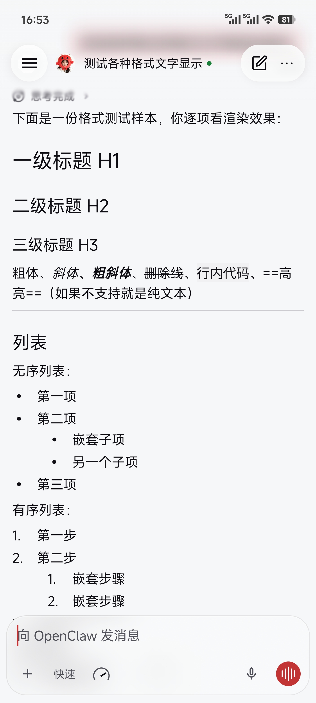
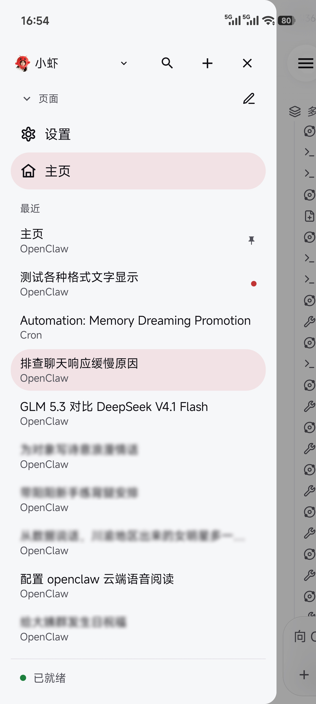
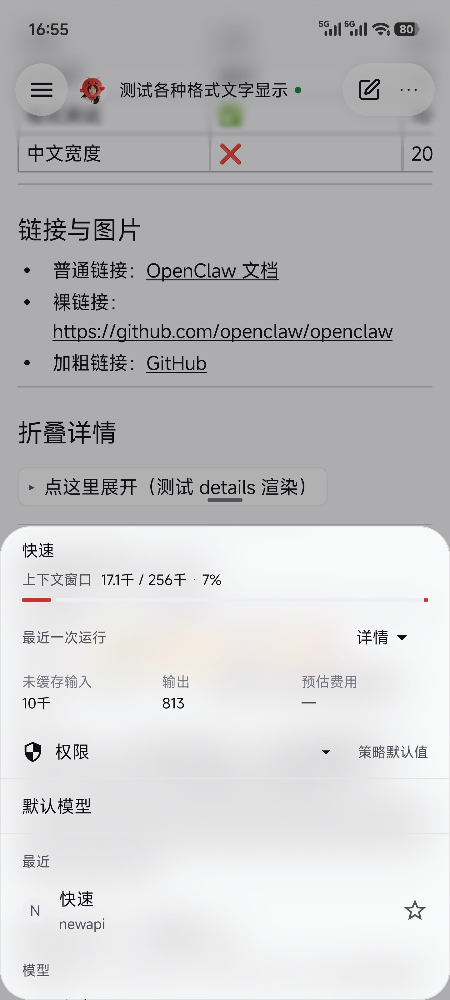
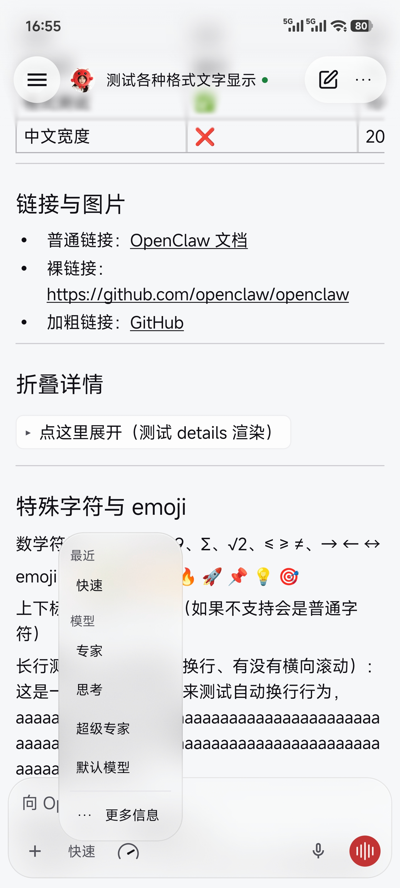
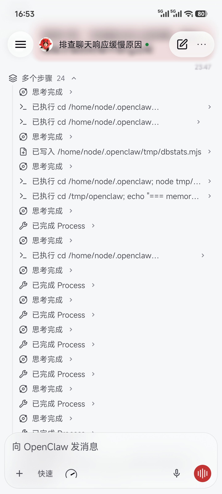
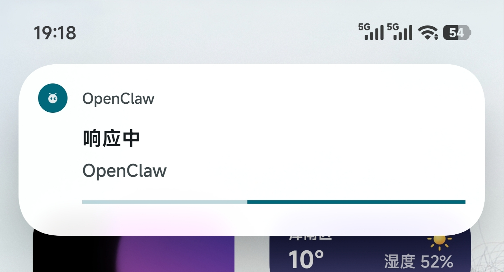

<div align="center">
  
  <h1>OpenClaw X</h1>
  <p><b>把 AI 助手装进自己的手机</b> —— 你的 Gateway、你的模型、你的设备。<br/>
  OpenClaw Android 客户端的个人分支，移动端体验全面重构。</p>
  <p><a href="#界面一览">界面</a> · <a href="#功能特性">功能</a> · <a href="#技术栈">技术栈</a> · <a href="#构建">构建</a></p>
</div>

## 项目简介

[OpenClaw](https://github.com/openclaw/openclaw) 是开源的个人 AI 助手框架：网关跑在你自己的机器上，负责模型接入、消息渠道、记忆与工具；客户端负责对话与设备能力。

**OpenClaw X 是它的 Android 客户端分支。** 在官方实现之上，这个分支做两件事：把移动端的材质、动效、排版、信息层级按 iOS 级标准重排一遍；补齐 Android 侧长期缺失的能力——思考链可视化、流式打字机、系统级运行状态、原生公式渲染。

仓库只保留 Android 相关工程，iOS / macOS / 服务端请去上游。

## 界面一览

| 对话与排版 | 侧边栏抽屉 | 上下文卡片 |
| :--: | :--: | :--: |
|  |  |  |

| 模型选择 | 思考链与工具链 | 运行状态上岛 |
| :--: | :--: | :--: |
|  |  |  |

## 功能特性

### 流式对话，跟手且不糊

- 时间基准的打字机输出，配合 60ms 采样节流：长回复逐字浮现，不会出现成团卡顿或整屏突跳
- Markdown 全量排版：标题层级、嵌套列表、表格、代码块、行内代码、删除线、高亮、链接与折叠详情
- 数学公式**原生渲染**（不走 WebView）：跟随主题与正文颜色，无白块闪烁、无额外内核开销
- 消息气泡重设计：用户消息与 agent 回复分层清晰，时间戳外置不挤占正文
- 长按消息唤出玻璃化操作菜单，位置跟随手指；离开底部较远时浮现"回到底部"按钮，停止滚动后才出现

### 把 agent 的过程摊开给你看

- 思考链与工具链完整呈现：思考段落、命令执行、文件写入、工具结果各自成行并保留状态词（思考完成 / 已执行 / 已写入 / 已完成）
- 长任务自动聚合为「多个步骤 N」，可逐条展开细节；少量工具不强行折叠成聚合行
- 思考预览支持展开与收起，行出现带入场动画；间距按正文节奏对齐，没有 Material 默认的大空洞

### 材质与动效

- 全局毛玻璃体系：顶栏渐进式模糊并延伸到状态栏；浮动卡片跨窗口实时取背景作为模糊源
- 非线性 spring 动效：卡片从锚点角落展开、收尾回弹，过冲部分被裁切干净，不留"两层不同步"的白边
- 圆形高光按钮（新建会话 / 菜单 / 侧边栏）：环境光与高光分层投影，不再是灰描边贴片

### 推挤式侧边栏

- 抽屉滑出时页面整体平移、随进度渐进压暗，内容逐级释放而不是被挤压变形
- 页面折叠项与最近会话行统一圆角与内边距尺度，左右宽度完全对齐
- 长按会话唤出玻璃菜单；删除走「先归档再删除」，不会留下幽灵会话
- 加载指示改到标题旁，消除会话列表的跳动

### 模型、上下文与思考强度

- 点输入栏的模型位弹出模型浮动卡：最近使用、按供应商分组、收藏星标
- "更多信息"进入上下文卡：窗口占用进度、最近一次运行的输入 / 输出 token 与预估费用、权限策略、思考强度
- 选择模型不打断输入法状态，不会误弹键盘

### 系统级运行状态

- Agent 运行时发出实时通知：**响应中 / 思考中 / 生成中 / 已完成**，在小米超级岛与 Android 16 Live Updates 上直接可见，无需厂商白名单
- 运行期间这条通知就是前台保活本体，回复生成全程连接稳定；空闲时自动收起，不再常驻一条"已连接"通知
- 断线重连期间运行状态保留，网络抖动不会让通知凭空消失

### 细节与稳定

- 全局震动反馈开关、字号滑条调节
- 冷启动直达对话；按网关记住上次选择的智能体，不再回落到列表第一个
- 切后台返回不自动弹起输入法
- 断线重连对账修复：已结束的运行不再卡在"运行中"、停止按钮不再失效

## 技术栈

| 方向 | 选型 |
| --- | --- |
| 语言 / UI | Kotlin 2.4 · Jetpack Compose · Material 3 |
| 材质 | Haze 2（实时背景模糊） |
| 动效 | Compose `Animatable` + 自定义非线性 spring |
| Markdown | commonmark-java → `AnnotatedString` 直排 |
| 公式 | 原生 LaTeX 渲染（Canvas 直绘，无 WebView） |
| 数据 | Room 3 · kotlinx-serialization |
| 网络 | OkHttp 5（Gateway WebSocket 长连接） |
| 媒体 | Media3（语音播放与采集）· Coil 3（图片） |
| 字体 | MiSans 可变字重（Variable Font） |
| 并发 | kotlinx-coroutines + StateFlow |
| 构建 | Gradle 9.7 · AGP 9.4 · compileSdk 37 / targetSdk 36 / minSdk 31 |

## 构建

```bash
cd apps/android

# Debug
./gradlew app:assemblePlayDebug

# Release（单 ABI 打包，产物在 app/build/outputs/apk/play/release/）
./gradlew app:assemblePlayRelease \
  -PopenclawAbiFilters=arm64-v8a \
  -PopenclawBuildCommit=$(git rev-parse HEAD) \
  -PopenclawBuildTimestamp=$(date -u +%Y-%m-%dT%H:%M:%SZ)
```

需要 JDK 17+ 与 Android SDK（`apps/android/local.properties` 配 `sdk.dir`）。

**签名**：仓库不含任何密钥。发行构建通过 `-POPENCLAW_ANDROID_STORE_PASSWORD=...` / `-POPENCLAW_ANDROID_KEY_PASSWORD=...` 或 `~/.gradle/gradle.properties` 提供；`.gitignore` 已忽略 `*.keystore` / `*.jks` / `signing/`。

## 仓库范围

本仓库是上游 monorepo 的 **Android 子集快照**（不含上游历史）：

```
apps/android/                     # Android 应用（Kotlin + Jetpack Compose）
apps/shared/                      # 构建期共享资源（tool-display、mermaid 产物）
packages/mermaid-renderer/        # 构建期依赖
packages/normalization-core/      # 构建期依赖
patches/                          # 构建补丁
LICENSE  THIRD_PARTY_NOTICES.md   # 上游许可与第三方声明（原样保留）
```

`apps/android/app/build.gradle.kts` 直接引用 `apps/shared`、`ui/public/provider-icons` 与 `packages/mermaid-renderer`，这些目录不可删。

## 许可与声明

- 代码沿用上游 **MIT License**，版权声明、许可文本与 `THIRD_PARTY_NOTICES.md` 完整保留。
- 本项目为**个人非官方分支**，与 OpenClaw Foundation 无关联；"OpenClaw" 名称与标志的商标权利归原项目所有。
- 上游：https://github.com/openclaw/openclaw
